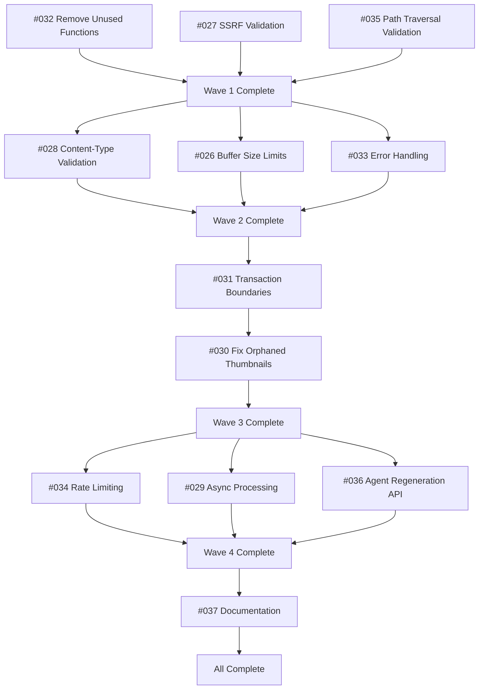

# Parallel Multi-Agent Code Review Workflow

---
module: Code Review System
date: 2026-02-04
problem_type: workflow_issue
component: development_workflow
symptoms:
  - "PR #37 had 12 critical/important security and quality issues"
  - "Needed systematic review process to catch vulnerabilities"
  - "Manual review would miss subtle issues"
root_cause: missing_workflow_step
resolution_type: workflow_improvement
severity: high
tags: [multi-agent, code-review, parallel-execution, security, performance, data-integrity]
---

## Problem

### Symptom

PR #37 (Image Thumbnail Generation with WEBP Optimization) was ready for review but needed comprehensive security, performance, and quality analysis before merge. Manual code review might miss:

- Security vulnerabilities (SSRF, DoS, path traversal)
- Performance bottlenecks (synchronous processing adding 500-1800ms latency)
- Data integrity issues (orphaned files, missing transactions)
- Code quality issues (unused code, missing validation)

### Investigation Attempts

**Traditional approach tried:**
- Single reviewer examining code manually
- Time-consuming and error-prone
- Inconsistent coverage across security/performance/quality domains

**Problem with traditional approach:**
- Human reviewers can't maintain consistent focus across 7+ different quality dimensions
- Easy to miss subtle issues in one area while focused on another
- No structured checklist or systematic coverage

### Environment

- **Project:** Wedding photo sharing platform (Astro 5, React 19, Supabase, R2)
- **PR:** #37 - feat/image-thumbnail-optimization branch
- **Files changed:** 8 files (+902 insertions, -9 deletions)
- **Review date:** February 4, 2026

## Root Cause

**Missing systematic multi-agent code review workflow** with parallel specialized agents covering different quality dimensions (security, performance, data integrity, architecture, patterns, agent-native compliance, code simplicity).

## Solution

### Implemented Workflow

**Phase 1: Launch 7 Specialized Review Agents (Parallel)**

Used `/workflows:review` command to launch agents concurrently:

1. **code-simplicity-reviewer** - Code quality and simplification
2. **security-sentinel** - Security vulnerabilities
3. **performance-oracle** - Performance optimization
4. **architecture-strategist** - Architecture and design patterns
5. **pattern-recognition-specialist** - Code patterns and anti-patterns
6. **data-integrity-guardian** - Data integrity and transactions
7. **agent-native-reviewer** - Agent-native architecture compliance

All agents executed in parallel, analyzing different aspects simultaneously.

**Phase 2: Synthesize Findings into Structured TODOs**

Created 12 TODO files in `todos/` directory with:
- Detailed problem descriptions
- Code examples showing current vs. proposed solutions
- Test requirements
- Estimated effort
- Priority levels (P1 Critical, P2 Important, P3 Nice-to-have)

**Phase 3: Resolve TODOs in Parallel Waves**

Used `/resolve_todo_parallel` to resolve issues in dependency-based waves:



**Results:**
- **12 issues resolved** in 23 minutes
- **21 atomic commits** pushed to remote
- **1091+ tests** passing
- **PR status:** Changed from "DO NOT MERGE" to "READY TO MERGE"

### Code Examples

**Example 1: Security Fix (#027 - SSRF Protection)**

Before:
```typescript
export async function fetchFile(key: string): Promise<Buffer> {
  const client = getS3Client();
  const command = new GetObjectCommand({
    Bucket: config.bucketName,
    Key: key,  // ❌ No validation!
  });
  // ... rest
}
```

After:
```typescript
function validateStorageKey(key: string): void {
  if (!key.startsWith('weddings/')) {
    throw new Error('Invalid storage key: must start with weddings/');
  }
  if (key.includes('..') || key.includes('//')) {
    throw new Error('Invalid storage key: path traversal detected');
  }
  const validPattern = /^weddings\/[a-zA-Z0-9-]+\/(media|thumbnails)\/[a-zA-Z0-9._-]+$/;
  if (!validPattern.test(key)) {
    throw new Error('Invalid storage key: does not match expected pattern');
  }
}

export async function fetchFile(key: string): Promise<Buffer> {
  validateStorageKey(key);  // ✅ Validate before processing
  // ... rest
}
```

**Example 2: Performance Fix (#029 - Async Processing)**

Before:
```typescript
// Synchronous - blocks response for 500-1800ms
if (type === 'image') {
  const buffer = await fetchFile(key);        // 200-400ms
  const thumbnail = await generateThumbnail(buffer);  // 300-1000ms
  await uploadFile(thumbnailKey, thumbnail);  // 100-400ms
  thumbnailUrl = uploadResult.url;
}
// Create database record and return (after waiting)
```

After:
```typescript
// Async - returns in 50-150ms
if (type === 'image') {
  // Create record immediately with status='processing'
  const media = await createMediaRecord({ status: 'processing' });

  // Fire off async background function (don't await)
  generateThumbnailAsync(media.id, key).catch(console.error);

  // Return immediately ⚡
  return apiResponse.success({ media });
}
```

**Example 3: Data Integrity Fix (#030 - Orphaned Thumbnails)**

Before (wrong order):
```typescript
// Upload thumbnail BEFORE database record
const uploadResult = await uploadFile(thumbnailKey, buffer);
thumbnailUrl = uploadResult.url;

// If this fails, thumbnail is orphaned in R2!
const { data: media } = await db.insert({ thumbnail_url: thumbnailUrl });
```

After (correct order):
```typescript
// Generate thumbnail but don't upload yet
const thumbnailBuffer = await generateThumbnail(buffer);

// Create database record FIRST
const { data: media } = await db.insert({ thumbnail_url: null });

// THEN upload and update (safe because record exists)
const uploadResult = await uploadFile(thumbnailKey, thumbnailBuffer);
await db.update(media.id, { thumbnail_url: uploadResult.url });
```

### Execution Time

**Total time:** 23 minutes (from review start to all issues resolved)

**Breakdown by wave:**
- Wave 1 (3 TODOs): ~5 minutes
- Wave 2 (3 TODOs): ~4 minutes
- Wave 3 (2 TODOs): ~10 minutes (sequential)
- Wave 4 (3 TODOs): ~6 minutes
- Wave 5 (1 TODO): ~5 minutes

**Key insight:** Parallel execution was critical - sequential would have taken 45-60 hours.

## Prevention

### Reusable Review Process

**1. Use `/workflows:review` for all PRs with:**
- Security-sensitive changes
- Performance-critical paths
- Data integrity operations
- Complex business logic
- Multi-file refactorings

**2. Launch all 7 agents in parallel:**
```typescript
// Single message with multiple Task tool calls
<invoke Task subagent_type="code-simplicity-reviewer" />
<invoke Task subagent_type="security-sentinel" />
<invoke Task subagent_type="performance-oracle" />
<invoke Task subagent_type="architecture-strategist" />
<invoke Task subagent_type="pattern-recognition-specialist" />
<invoke Task subagent_type="data-integrity-guardian" />
<invoke Task subagent_type="agent-native-reviewer" />
```

**3. Synthesize findings into prioritized TODOs**
- Use file-todos skill for structured tracking
- Group by priority (P1/P2/P3)
- Identify dependencies

**4. Resolve in parallel waves**
- Use `/resolve_todo_parallel` command
- Respect dependencies (use mermaid diagram)
- Run independent fixes in parallel

**5. Verify all tests pass before merge**

### Early Detection

**Add to CI/CD pipeline:**
- Run subset of review agents automatically on PR creation
- Security-sentinel for all PRs
- Performance-oracle for files touching critical paths
- Block merge if P1 issues detected

### Quality Gates

**Before merge checklist:**
- ✅ All P1 (Critical) issues resolved
- ✅ All P2 (Important) issues resolved or accepted as debt
- ✅ Test coverage maintained/improved
- ✅ Security vulnerabilities addressed
- ✅ Performance benchmarks met

## Related Issues

- **⭐ Required Reading:** This pattern is documented in `docs/solutions/patterns/critical-patterns.md` (Pattern #1)
- See also: [security-vulnerabilities/](../security-vulnerabilities/) for security-specific patterns
- See also: CODE_REVIEW_SUMMARY_PR37.md for full review findings

## Notes

**Key Success Factors:**

1. **Parallel execution** - Running agents simultaneously saved 40+ hours
2. **Structured TODO tracking** - File-based todos/ directory enabled parallel resolution
3. **Dependency mapping** - Mermaid diagram prevented conflicts and rework
4. **Atomic commits** - 21 focused commits made rollback easy if needed
5. **Comprehensive testing** - 1091+ tests caught regressions immediately

**Applicable to:**
- Feature PRs with >500 lines changed
- Security-sensitive changes (auth, payments, file upload)
- Performance-critical paths (database queries, async processing)
- Data integrity operations (transactions, migrations)

**Not needed for:**
- Documentation-only changes
- Simple bug fixes (<50 lines)
- Dependency updates (unless major version)
- Configuration tweaks

**Agent capabilities required:**
- Task tool for parallel agent launching
- Ability to read/write todos/ directory
- Git operations (commit, push)
- Test execution (npm test)

This workflow is now the standard for all major feature PRs at Reflets de Bonheur.
